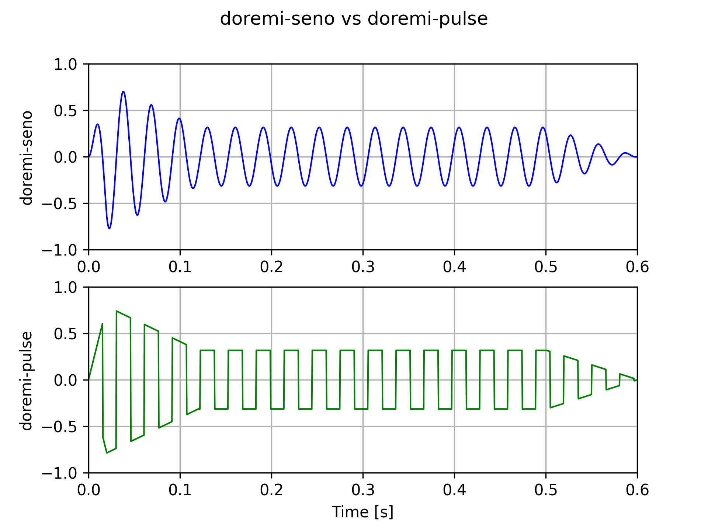
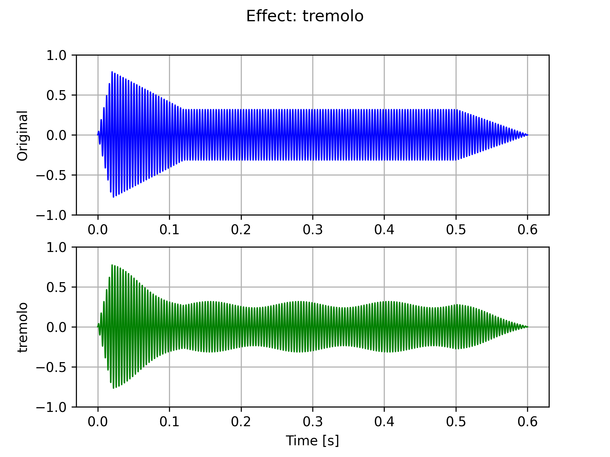
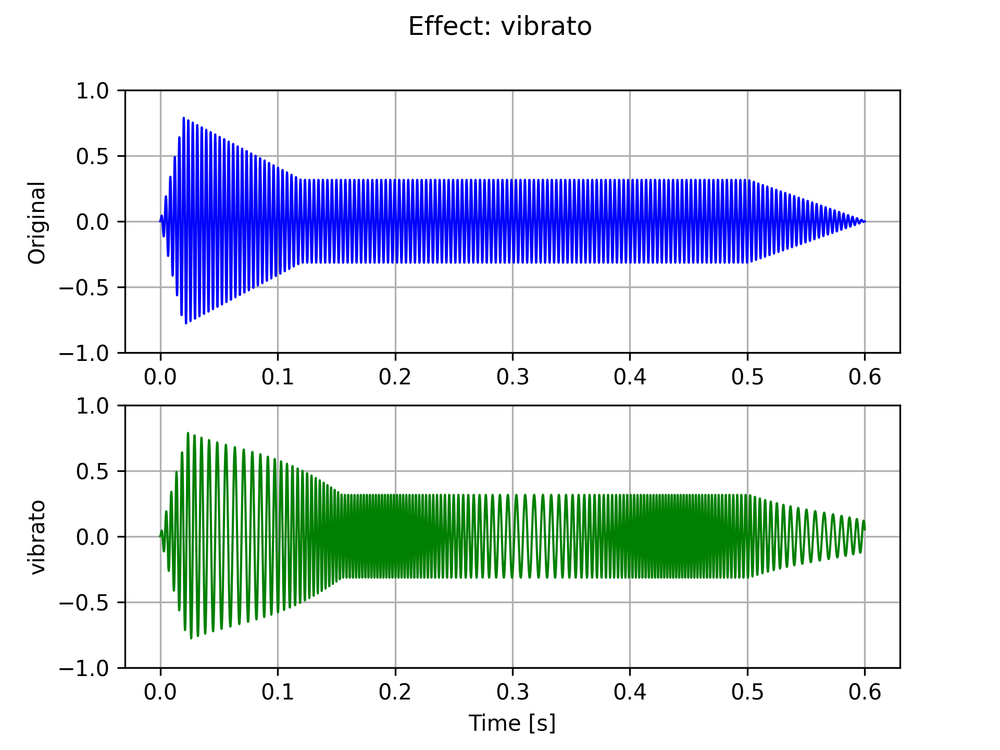
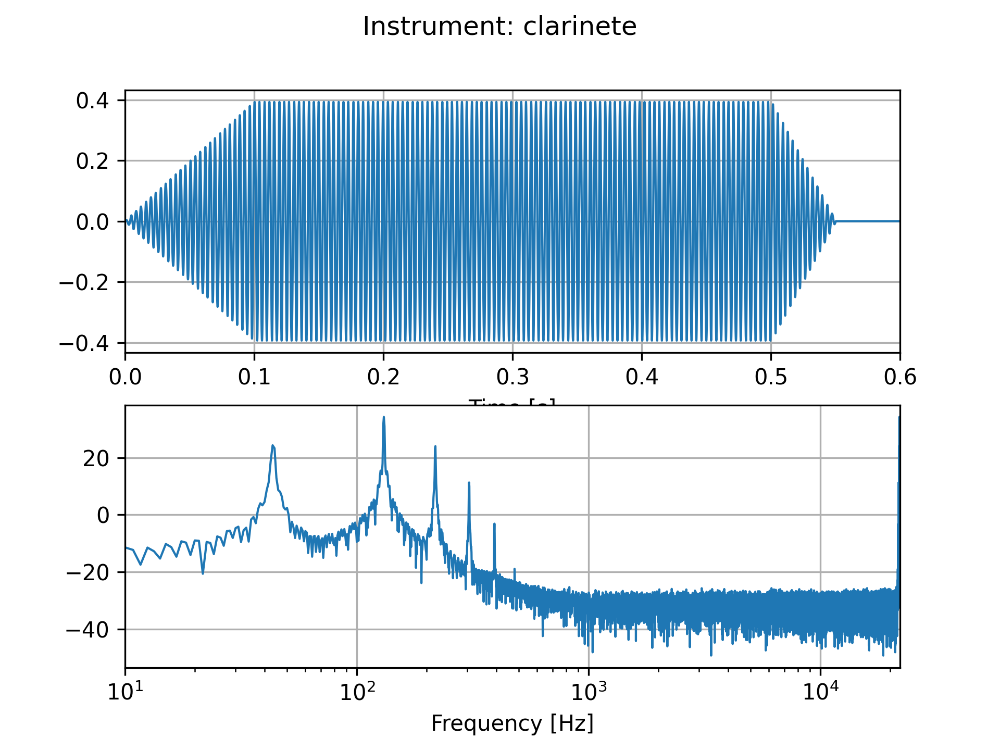

# PAV - P5: síntesis musical polifónica

Obtenga su copia del repositorio de la práctica accediendo a [Práctica 5](https://github.com/albino-pav/P5) 
y pulsando sobre el botón `Fork` situado en la esquina superior derecha. A continuación, siga las
instrucciones de la [Práctica 2](https://github.com/albino-pav/P2) para crear una rama con el apellido de
los integrantes del grupo de prácticas, dar de alta al resto de integrantes como colaboradores del proyecto
y crear la copias locales del repositorio.

Como entrega deberá realizar un *pull request* con el contenido de su copia del repositorio. Recuerde que
los ficheros entregados deberán estar en condiciones de ser ejecutados con sólo ejecutar:

~~~~~~~~~~~~~~~~~~~~~~~~~~~~~~~~~~~~~~~~~~~~~~~~~~~~~.sh
  make release
~~~~~~~~~~~~~~~~~~~~~~~~~~~~~~~~~~~~~~~~~~~~~~~~~~~~~

A modo de memoria de la práctica, complete, en este mismo documento y usando el formato *markdown*, los
ejercicios indicados.

## Ejercicios.

### Envolvente ADSR.

Tomando como modelo un instrumento sencillo (puede usar el InstrumentDumb), genere cuatro instrumentos que
permitan visualizar el funcionamiento de la curva ADSR.

El fichero de los que contiene los instrumentos mostrados a continuación es [dumb.orc](work/dumb.orc).

Las gráficas de los instrumentos con envolvente ADSR estan *bastante* inspiradas en la siguiente
[imagen](https://blog.landr.com/wp-content/uploads/2016/10/ASDR-01.jpg):


* Un instrumento con una envolvente ADSR genérica, para el que se aprecie con claridad cada uno de sus
  parámetros: ataque (A), caída (D), mantenimiento (S) y liberación (R).

    ```text
    # Generic ADSR
    1	InstrumentDumb	ADSR_A=0.20; ADSR_D=0.10; ADSR_S=0.20; ADSR_R=0.30; N=16;
    ```
    

* Un instrumento *percusivo*, como una guitarra o un piano, en el que el sonido tenga un ataque rápido, no
  haya mantenimiemto y el sonido se apague lentamente.
  - Para un instrumento de este tipo, tenemos dos situaciones posibles:
    * El intérprete mantiene la nota *pulsada* hasta su completa extinción.

    ```text
    # Percusive 1 ADSR
    2	InstrumentDumb	ADSR_A=0.01; ADSR_D=0.20; ADSR_S=0.00; ADSR_R=0.00; N=127;
    ```
    


    * El intérprete da por finalizada la nota antes de su completa extinción, iniciándose una disminución
	  abrupta del sonido hasta su finalización.
    
    ```text
    # Percusive 2 ADSR
    3	InstrumentDumb	ADSR_A=0.01; ADSR_D=0.20; ADSR_S=0.00; ADSR_R=0.01; N=127;
    ```
    

  - Debera representar en esta memoria **ambos** posibles finales de la nota.

* Un instrumento *plano*, como los de cuerdas frotadas (violines y semejantes) o algunos de viento. En
  ellos, el ataque es relativamente rápido hasta alcanzar el nivel de mantenimiento (sin sobrecarga), y la
  liberación también es bastante rápida.

    ```text
    # Plain ADSR
    4	InstrumentDumb	ADSR_A=0.05; ADSR_D=0.00; ADSR_S=0.40; ADSR_R=0.60; N=92;
    ```
    

Para los cuatro casos, deberá incluir una gráfica en la que se visualice claramente la curva ADSR. Deberá
añadir la información necesaria para su correcta interpretación, aunque esa información puede reducirse a
colocar etiquetas y títulos adecuados en la propia gráfica (se valorará positivamente esta alternativa).


*Nota:* Ficheros generados para este ejercicio:
-   [Instrumentos (.orc)](work/instruments/adsr.orc)
-   [Partitura (.sco)](work/scores/adsr.sco)
-   [Audio (.wav)](work/music/adsr.wav)
-   [Generar ADSR (.py)](scripts/plot-adsr.py)

### Instrumentos Dumb y Seno.

Implemente el instrumento `Seno` tomando como modelo el `InstrumentDumb`. La señal **deberá** formarse
mediante búsqueda de los valores en una tabla.

- Incluya, a continuación, el código del fichero `seno.cpp` con los métodos de la clase Seno.
  ```cpp
  #include <iostream>
  #include <math.h>
  #include "seno.h"
  #include "keyvalue.h"
  
  #include <stdlib.h>
  
  using namespace upc;
  using namespace std;
  
  Seno::Seno(const std::string &param) 
    : adsr(SamplingRate, param) {
    bActive = false;
    x.resize(BSIZE);
  
    KeyValue kv(param);
  
    if (!kv.to_int("N", N)) {
      N = 40; //default value
    }
  
    //Create a tbl with one period of a sinusoidal wave
    tbl.resize(N);
    float phase = 0, step = 2 * M_PI /(float) N;
    index = 0.0f;
  
    for (int i=0; i < N ; ++i) {
      tbl[i] = sin(phase);
      phase += step;
    }
  }
  
  
  void Seno::command(long cmd, long note, long vel) {
    if (cmd == 9) {		//'Key' pressed: attack begins
      bActive = true;
      adsr.start();
      index = 0;
  
      if (vel > 127) {
          vel = 127;
      }
      A = vel / 127.0f;
  
      // Calculate delta for the table index
      float f0_note = 440 * powf(2, (note - 69.0f) / 12.0f);
      delta_idx = (float)N * f0_note / SamplingRate;
      
    } else if (cmd == 8) {	//'Key' released: sustain ends, release begins
      adsr.stop();
  
    } else if (cmd == 0) {	//Sound extinguished without waiting for release to end
      adsr.end();
    }
  }
  
  
  const vector<float> & Seno::synthesize() {
    if (not adsr.active()) {
      x.assign(x.size(), 0);
      bActive = false;
      return x;
  
    } else if (not bActive) {
      return x;
    }
  
    float frac;
    int il, ir;
  
    for (unsigned int i = 0; i < x.size(); ++i, index += delta_idx) {
      // It's like the modulus operator but with floats
      while (index > (float)tbl.size()) { index -= (float)tbl.size();}
  
      // Get base and fraction indices
      il = (int)floor(index);
      frac = index - (float)il;
      ir = il == N-1 ? 0 : il + 1;
  
      // Lerp
      x[i] = A * ((1-frac)*tbl[il] + frac*tbl[ir]);
  
      // Uncomment to get data to plot
      // printf("%.10f\t%.10f\t%.10f\n", tbl[il], tbl[ir], ((1-frac)*tbl[il] + frac*tbl[ir]));
    }
  
    //apply envelope to x and update internal status of ADSR
    adsr(x);
  
    return x;
  }
  ```

- Explique qué método se ha seguido para asignar un valor a la señal a partir de los contenidos en la tabla,
  e incluya una gráfica en la que se vean claramente (use pelotitas en lugar de líneas) los valores de la
  tabla y los de la señal generada.

  El primer paso es calcular el tono de la nota, en hercios, a partir de su valor en semitonos. Esto se hace
  a partir de la formula dada en el enunciado:
  ```cpp
  float f0_note = 440 * powf(2, (note - 69.0f) / 12.0f);
  ```

  Una vez se tiene el tono se debe calcular el avance del indice con la siguiente fórmula:
  ```cpp
  delta_idx = (float)N * f0_note / SamplingRate;
  ```

  Como esta delta seguramente no sera un valor entero se tendran indices no enteros, para solucionar esto hay
  dos maneras:
    - Redondear: La mas fácil de implementar. (**No implementado**)
    - Interpolación lineal, que es por la que he optado. En este caso se usa la parte decimal del indice
      como peso.
  
  *Nota:* A la hora de interpolar puede que se tenga que hacer entre la última y primera muestra.

  En la siguiente imagen se pueden ver los valores de la tabla y los valores interpolados:

  
    
- Si ha implementado la síntesis por tabla almacenada en fichero externo, incluya a continuación el código
  del método `command()`.
 
  El método `command()` es el mismo que para el fichero [seno.cpp](src/instruments/seno.cpp). Lo único que
  varia es el constructor, en este se supone que el fichero solo contiene un periodo del señal y el numero
  de muestras del fichero es `N`.

  ```cpp
    FicTabla::FicTabla(const std::string &param) 
    : adsr(SamplingRate, param) {
      bActive = false;
      x.resize(BSIZE);

      KeyValue kv(param);

      std::string file_name;
      static string kv_null;
      if ((file_name = kv("file")) == kv_null) {
        cerr << "Error: no se ha encontrado el campo con el fichero de la señal para un instrumento FicTabla" << endl;
        throw -1;
      }
    
      unsigned int fm;
      if (readwav_mono(file_name, fm, tbl) < 0) {
        cerr << "Error: no se puede leer el fichero " << file_name << " para un instrumento FicTabla" << endl;
        throw -1;
      }

      N = tbl.size();
    }
  ```

  Comparación de los ficheros doremi, arriba generado con el instrumento Seno, abajo con los
  siguientes instrumentos:

  - FicTable y el fichero [pulse.wav](work/samples/pulse.wav)
  - FicTable y el fichero [sawtooth.wav](work/samples/sawtooth.wav)
  - FicTable y el fichero [triangle.wav](work/samples/triangle.wav)
  - FicTable y el fichero [white-noise.wav](work/samples/white-noise.wav)

  
  
  
  
  
  
  
  
  *Comparación hecha a bajas frecuencias para apreciar mejor las formas de onda.*

  Usando el fichero [white-noise.wav](work/samples/white-noise.wav) suena como un taladro, pero las
  notas se diferencian.

*Nota:* Ficheros generados/usados para este ejercicio:
-   [Instrumentos (.orc)](work/instruments/seno.orc)
-   [Partitura (.sco)](work/scores/doremi.sco)
-   [Audio DoReMi (.wav)](work/doremi/doremi.wav)
-   [Pulse (.orc)](work/instruments/pulse.orc)
-   [Pulse (.wav)](work/samples/pulse.wav)
-   [Sawtooth (.orc)](work/instruments/sawtooth.orc)
-   [Sawtooth (.wav)](work/samples/sawtooth.wav)
-   [Sine (.orc)](work/instruments/sine.orc)
-   [Sine (.wav)](work/samples/sine.wav)
-   [Triangle (.orc)](work/instruments/triangle.orc)
-   [Triangle (.wav)](work/samples/triangle.wav)
-   [White Noise (.orc)](work/instruments/white-noise.orc)
-   [White Noise (.wav)](work/samples/white-noise.wav)
-   [Audio DoReMi con pulso (.wav)](work/doremi/doremi-pulse.wav)
-   [Generar gráfica interpolación (.py)](scripts/plot-interpolation.py)
-   [Generar gráfica comparación (.py)](scripts/plot-comparison.py)
-   [Generar pulsos (.py)](scripts/genpulses.py)

### Efectos sonoros.

- Incluya dos gráficas en las que se vean, claramente, el efecto del trémolo y el vibrato sobre una señal
  sinusoidal. Deberá explicar detalladamente cómo se manifiestan los parámetros del efecto (frecuencia e
  índice de modulación) en la señal generada (se valorará que la explicación esté contenida en las propias
  gráficas, sin necesidad de *literatura*).

  Se han usado parametros un poco *bruscos* para que se vean mejor los efectos. Con valores mucho mas
  pequeños los efectos se oyen pero es mas dificil verlo en las gráficas (sobre todo en el vibrato).

  #### Tremolo
  

  Parametros:
  ```text
  13  Tremolo A=0.25;  fm=8;
  ```

  Para generar el `WAVE`:
  ```bash
  synth --effect-file=work/effects/tremolo.orc work/instruments/seno.orc work/scores/doremi-effects.sco work/music/doremi-tremolo.wav
  ```

  #### Vibrato
  

  Parametros:
  ```text
  13  Vibrato fm=4;  I=12;
  ```

  Para generar el `WAVE`:
  ```bash
  synth --effect-file=work/effects/vibrato.orc work/instruments/seno.orc work/scores/doremi-effects.sco work/music/doremi-vibrato.wav
  ```

- Si ha generado algún efecto por su cuenta, explique en qué consiste, cómo lo ha implementado y qué
  resultado ha producido. Incluya, en el directorio `work/ejemplos`, los ficheros necesarios para apreciar
  el efecto, e indique, a continuación, la orden necesaria para generar los ficheros de audio usando el
  programa `synth`.

  Se ha implementado la distorsión con hard y soft clipping, este se puede seleccionar con el parametro
  `clipping` en los ficheros `<effect>.orc`.

  #### Distortion (Hard clipping)
  

  Para el hard clipping simplemente es hacer un `clamp` de la señal entre `-threshold` y `+threshold`.
  Posteriormente se le puede aplicar una ganancia `A`.

  Parametros:
  ```text
  13  Distortion  threshold=0.2; A=4.0; clipping=hard;
  ```

  Para generar el `WAVE`:
  ```bash
  synth --effect-file=work/effects/distortion.orc work/instruments/seno.orc work/scores/doremi-low-effects.sco work/music/doremi-distortion-hard.wav
  ```
  #### Distortion (Soft clipping)
  

  Para el soft clipping primero se aplica el hard clipping y luego se le aplica un
  [smoothstep](https://en.wikipedia.org/wiki/Smoothstep) a la señal para suavizar las transiciones.

  Parametros:
  ```text
  13  Distortion  threshold=0.2; A=4.0; clipping=soft;
  ```

  Para generar el `WAVE`:
  ```bash
  synth --effect-file=work/effects/distortion.orc work/instruments/seno.orc work/scores/doremi-low-effects.sco work/music/doremi-distortion-soft.wav
  ```

  Comparación de ambas distorsiones:
  

*Nota:* Ficheros generados/usados para este ejercicio:
-   [Instrumentos (.orc)](work/instruments/seno.orc)
-   [Efecto tremolo (.orc)](work/effects/tremolo.orc)
-   [Efecto vibrato (.orc)](work/effects/vibrato.orc)
-   [Partitura (.sco)](work/scores/doremi-effects.sco)
-   [Audio DoReMi tremolo (.wav)](work/doremi/doremi-tremolo.wav)
-   [Audio DoReMi vibrato (.wav)](work/doremi/doremi-vibrato.wav)
-   [Generar graficas (.py)](scripts/plot-effect.py)

### Síntesis FM.

Construya un instrumento de síntesis FM, según las explicaciones contenidas en el enunciado y el artículo
de [John M. Chowning](https://web.eecs.umich.edu/~fessler/course/100/misc/chowning-73-tso.pdf). El
instrumento usará como parámetros **básicos** los números `N1` y `N2`, y el índice de modulación `I`, que
deberá venir expresado en semitonos.

- Use el instrumento para generar un vibrato de *parámetros razonables* e incluya una gráfica en la que se
  vea, claramente, la correspondencia entre los valores `N1`, `N2` e `I` con la señal obtenida.

  Comparando la Figura 1 del artículo de Chowning *(insertada abajo)* con la gráfica generada por mi se
  pueden ver similitudes. A partir de la posición de los picos se pueden obtener `fc` y `fm`, y con
  estimar `N1` y `N2`. También se aprecia que a mayor `I` mayores son los picos.

  La gráfica generada corresponde a la primera nota del archivo [doremi.wav](work/doremi/doremi.wav), el Do
  central, que tiene como frecuencia 261.63 Hz.

  

  

  A partir de la posición de los picos de la gráfica se ha estimado fc y fm, partir de estos N1 y N2.
  Como se puede ver estos coinciden con los parametros usados para generar el señal.

  *Solo se esta mostrando la parte 'interesante' del espectro para apreciar mas los detalles.*
  
- Use el instrumento para generar un sonido tipo clarinete y otro tipo campana. Tome los parámetros del
  sonido (N1, N2 e I) y de la envolvente ADSR del citado artículo. Con estos sonidos, genere sendas escalas
  diatónicas (fichero `doremi.sco`) y ponga el resultado en los ficheros `work/doremi/clarinete.wav` y
  `work/doremi/campana.wav`.

  #### Clarinete

  

  Parametros:
  ```text
  1   SynthFM ADSR_A=0.10; ADSR_D=0.00; ADSR_S=1.00; ADSR_R=0.05; I=4.0; N1=3.0; N2=2.0;
  ```

  Commando:
  ```bash
  synth work/instruments/clarinete.orc work/scores/doremi.sco work/doremi/clarinete.wav
  ```

  #### Campana

  

  Parametros:
  ```text
  1   SynthFM ADSR_A=0.01; ADSR_D=0.50; ADSR_S=0.00; ADSR_R=0.00; I=10.0; N1=1.0; N2=1.6;
  ```

  Commando:
  ```bash
  synth work/instruments/campana.orc work/scores/doremi.sco work/doremi/campana.wav
  ```

  * También puede colgar en el directorio work/doremi otras escalas usando sonidos *interesantes*. Por
    ejemplo, violines, pianos, percusiones, espadas láser de la
	[Guerra de las Galaxias](https://www.starwars.com/), etc.

*Nota:* Ficheros generados/usados para este ejercicio:
-   [SynthFM Genérico (.orc)](work/instruments/synthfm.orc)
-   [Clarinete (.orc)](work/instruments/clarinete.orc)
-   [Campana (.orc)](work/instruments/campana.orc)
-   [DoReMi (.sco)](work/scores/doremi.sco)
-   [Audio SynthFM Genérico (.wav)](work/doremi/doremi-synthfm.wav)
-   [Audio Clarinete (.wav)](work/doremi/clarinete.wav)
-   [Audio Campana (.wav)](work/doremi/campana.wav)
-   [Generar graficas FM Synth (.py)](scripts/plot-fm.py)
-   [Generar graficas instrumentos (.py)](scripts/plot-instrument.py)

### Orquestación usando el programa synth.

Use el programa `synth` para generar canciones a partir de su partitura MIDI. Como mínimo, deberá incluir la
*orquestación* de la canción *You've got a friend in me* (fichero `ToyStory_A_Friend_in_me.sco`) del genial
[Randy Newman](https://open.spotify.com/artist/3HQyFCFFfJO3KKBlUfZsyW/about).

- En este triste arreglo, la pista 1 corresponde al instrumento solista (puede ser un piano, flautas,
  violines, etc.), y la 2 al bajo (bajo eléctrico, contrabajo, tuba, etc.).
- Coloque el resultado, junto con los ficheros necesarios para generarlo, en el directorio `work/music`.
- Indique, a continuación, la orden necesaria para generar la señal (suponiendo que todos los archivos
  necesarios están en directorio indicado).

#### Toy Story


Comando a ejecutar:
```bash
synth -g 0.2 work/music/ToyStory_A_Friend_in_me.orc work/music/ToyStory_A_Friend_in_me.sco work/music/ToyStory_A_Friend_in_me.wav
```
Fichero resultante: [ToyStory_A_Friend_in_me.wav](work/music/ToyStory_A_Friend_in_me.wav)

También puede orquestar otros temas más complejos, como la banda sonora de *Hawaii5-0* o el villacinco de
John Lennon *Happy Xmas (War Is Over)* (fichero `The_Christmas_Song_Lennon.sco`), o cualquier otra canción
de su agrado o composición. Se valorará la riqueza instrumental, su modelado y el resultado final.
- Coloque los ficheros generados, junto a sus ficheros `score`, `instruments` y `efffects`, en el directorio
  `work/music`.
- Indique, a continuación, la orden necesaria para generar cada una de las señales usando los distintos
  ficheros.

#### Route 1

Banda sonora de la ruta 1 de los juegos Pokemon Rojo/Azul/Amarillo para GameBoy.


Comando a ejecutar:
```bash
synth -g 0.2 work/music/route1.orc work/music/route1.sco work/music/route1.wav
```
Fichero resultante: [route1.wav](work/music/route1.wav)

#### Mario

Banda sonora del juego Super Mario Bros.


Comando a ejecutar:
```bash
synth -g 0.2 work/music/mario.orc work/music/mario.sco work/music/mario.wav
```
Fichero resultante: [mario.wav](work/music/mario.wav)

#### Rick

Una canción de Rick Astley.


Comando a ejecutar:
```bash
synth -g 0.2 work/music/rick.orc work/music/rick.sco work/music/rick.wav
```
Fichero resultante: [rick.wav](work/music/rick.wav)

**_Fin._**